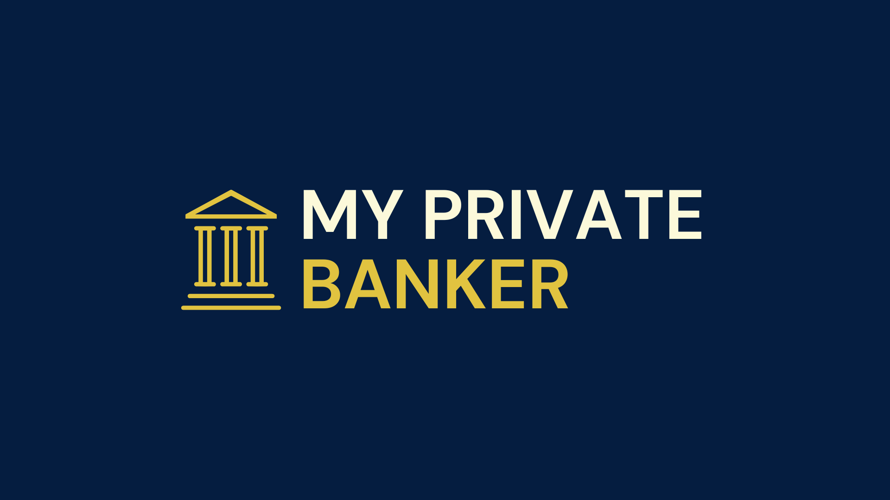

# 📊 My Private Banker
 

**My Private Banker** is a personal finance web application that helps users track income, expenses, savings, and gain a visual overview of their budget. Built to be simple, intuitive, and powerful for users at any financial stage — from students learning to manage money to adults building long-term savings.

---

## 🚀 Live Demo

🔗 [Visit the Landing Page](https://myprivatebanker.carrd.co/)

📖 [Read the Final Project Blog](https://www.linkedin.com/pulse/making-my-first-app-private-banker-devin-naicker-6jg5f)

👤 **Author**: [Thirushan Devin Naicker](https://www.linkedin.com/in/devin-naicker-659711a4)

---

## 🖼️ Screenshot Of App


*A sample user dashboard showing total income, expenses, savings, and a visual pie chart breakdown.*

---

## 📂 Table of Contents

- [About](#-about)
- [Installation (for Developers)](#-installation-for-developers)
- [Usage](#-usage)
- [Contributing](#-contributing)
- [Related Projects](#-related-projects)
- [License](#-license)
- [Resources](#-resources)

---

## 🧠 About

### Inspiration


While studying for my degree in Finance and Investments, I was shocked by how little the average person truly understood about managing their money. Concepts I considered fundamental — like budgeting, saving, or planning ahead — were missing from most people’s day-to-day lives.

What surprised me even more was who struggled:
Not just students or low-income earners, but also older adults who seemed financially comfortable, graduates with well-paying jobs, and even colleagues at the financial institution where I worked. It became clear to me that financial literacy and good money habits were not as common as I had assumed.

I soon realized that while some people didn’t prioritize financial planning at all, many did — but simply didn’t have accessible tools to help them budget, track spending, or plan for the future. The tools that did exist were often too complex, too impersonal, or simply not built with real people in mind.

That’s what inspired me to create My Private Banker —
A platform designed to simplify and personalize personal finance, helping everyday people take control of their money, build better habits, and ultimately improve their financial well-being.

### Tech Stack


#### Frontend: HTML5, CSS3, and JavaScript
For the frontend, I chose to use plain HTML, CSS, and JavaScript without any additional frameworks. This decision was intentional - I wanted to solidify my understanding of core web development concepts like layout, styling, interactivity, and DOM manipulation. It also kept the project lightweight and easier to manage within the two-week timeline.

#### Backend: Django
I used Django to handle backend logic, form processing, data validation, and database interactions. Django’s built-in features, such as the admin panel and user authentication, helped me build secure and structured backend functionality quickly.

#### Database: SQLite
I chose SQLite during development due to its simplicity and seamless integration with Django. It allowed me to focus on feature development without the overhead of setting up an external database service.

#### Planned Improvements & Scaling
While the current version of My Private Banker was built using HTML5, CSS3, JavaScript, and Django with SQLite, I’m actively planning to scale and modernize the tech stack as the app grows.

- I intend to migrate the frontend to React, allowing for more dynamic, component-based UI development and better scalability as features expand.
- For the database, I plan to transition from SQLite to PostgreSQL to support more robust relational data handling, improved performance under load, and smoother deployment.
- Finally, I aim to host the application on AWS, leveraging its scalability, reliability, and deployment flexibility — especially as I continue to develop features and prepare for potential multi-user    support.

These upgrades will help make My Private Banker more powerful, maintainable, and production-ready over time.

### Core Algorithms

<p align="center">
  
</p>

At the heart of **My Private Banker** is the ability to **capture, store, and intelligently use user financial planning data**. The app’s core algorithms are designed with three key goals in mind:

#### 1. Data Input Simplicity  
The user experience must make inputting financial information feel effortless. The design of the budget form (`add_budget.html`) includes dynamic behaviors like smart dropdowns, category filtering, and inline row addition — making it as seamless as possible for users to record their financial activity.

#### 2. Data Structure & Storage  
Each user’s financial data is stored in a structured, **relational format**. This allows for:
- Accurate tracking of income, expenses, and savings
- Flexible querying and filtering by type, category, or timeframe
- Scalable storage across multiple users with personalized records

By storing data cleanly, the app enables rich insights and future expansion (like trend analysis or forecasting).

#### 3. Visual Clarity  
Once the data is captured and structured, the final step is presenting it back to users in a **visually intuitive** way. This includes:
- A dashboard summary with income, expenses, and savings totals
- A pie chart to quickly identify how money is being allocated
- Category-based breakdowns for deeper insights

These visuals help users **understand and act** on their financial situation immediately.

Together, these three steps — **input → storage → visualization** — form the foundation of My Private Banker’s intelligent budgeting experience.

### Technical Challenges and How They Were Overcome


The biggest technical challenge I faced while building My Private Banker was maintaining stability while adding new features. I would often have a fully functioning app, only to see it break after introducing relatively small updates — especially in areas like form functionality and user input handling.

One major example was the user input forms for capturing financial data. I wanted to improve the UX by adding dropdown lists for categories, but once implemented, the form stopped saving correctly to the database. This caused a cascade of issues: the dashboard wouldn’t populate properly, and in some cases, the budget totals would double or display incorrect data.

Debugging these issues became a huge time sink. Each small change would introduce unpredictable bugs, making it difficult to isolate what was going wrong. To solve this, I started adding custom debugging code throughout the application — logging outputs, checking data flow step-by-step, and inspecting how user inputs were being processed. This helped me identify issues faster and also made the overall codebase more robust and easier to maintain.

### Next Iteration


I had a 2 week period create a Minimum Viable Product (MVP) as a solo developer. I built the app from scratch — combining my background in finance with my growing skills in software engineering. Due to the technical challenges faced, I was not able to implement all of the features I had wanted to due to the time constraints. 

In the next iterartion I would like to implement features such as money tracking, so users can see how closely they are following their budget. Goal target savings which would allow users to set savings goals and see visually the progress that they are making, calculations with timelines on future savings targets, predictions on user spending habbits, and an API so users can link bank accounts so transactions get updated in live time.

---

## 🛠️ Installation (for Developers)

> ⚠️ You do **not** need to install anything if you're using the [live site].  
> This section is for developers who want to run the app locally or contribute.

### Prerequisites:
- Python 3
- pip / pipenv
- Git
- Django

### Setup:

```bash
# Clone the repository
git clone https://github.com/your-username/my-private-banker.git

# Navigate to the project directory
cd my-private-banker

# Install dependencies
pip install -r requirements.txt

# Run migrations
python manage.py migrate

# Start the development server
python manage.py runserver
```
Then open your browser and visit `http://localhost:8000`.

---

## 💡 Usage

1. **Sign up or log in**
2. **Enter your total monthly income**
3. **Add your expenses and savings using the form**
4. **Get an instant breakdown with summaries and a pie chart**
5. **Edit or delete items anytime**

### Key Features:
- ✅ Budget builder with category tagging  
- ✅ Income and savings tracker  
- ✅ Pie chart breakdown of expenses vs. savings  
- ✅ User authentication and data privacy

---

## 🤝 Contributing

Contributions are welcome and appreciated!

If you'd like to improve **My Private Banker**, follow these steps:

1. **Fork** the repository  
2. **Create a new branch** for your feature or fix:
   ```bash
   git checkout -b feature/your-feature-name
   ```
3. **Make your changes** and commit them:
   ```bash
   git commit -m "Add your message here"
   ```
4. **Push to your fork:
   ```bash
   git push origin feature/your-feature-name
   ```
5. **Submit a Pull Request** for review

### ✅ Contribution Tips:
- Keep your changes focused and descriptive  
- Test your updates before submitting  
- If you’re unsure about something, feel free to open an issue first to discuss

---

## 🔗 Related Projects

- [Actual App (Example)](https://github.com/actualbudget/actual)
- [YNAB](https://www.ynab.com/)

---

## 📄 License

This project is licensed under the **MIT License**.  
See the [LICENSE](LICENSE) file for more information.
